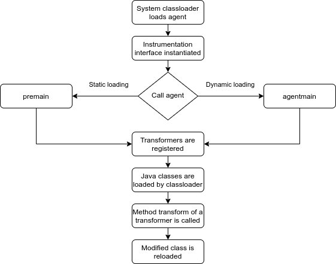

# Java Instrumentation
## Purpose
Java Instrumentation is framework for collecting information about application. The framework was introduced in Java SE 1.5. 
Framework provides utilities to add  byte-code to already existing compiled classes. 

The main class of the framework is Instrumentation interface. Instance of that class is available in an agent. 
The main class of the framework is Instrumentation interface. The interface provides API for byte-code modification.
The changes are additive, the changes do not modify existing behaviour or state of the application.

Java instrumentation could be used for creating monitoring agents, profilers, coverage analyzers, and event loggers.

## Instrumentation interface, main methods
- `addTransformer` adds a transformer to the instrumentation engine;
- `removeTransformer` removes a transformer;
- `getAllLoadedClasses` returns all classes currently loaded by the JVM;
- `retransformClasses` transforms a set of classes;
- `redefineClasses` redefines a set of classes, meaning replacing the definition of a class without reference to the existing class file bytes;

## Main components of Java Instrumentation
Java Instrumentation has few cornerstone components that allow us to transform byte-code in a running application.

### Agent
`Agent` is a jar file containing agent class itself and byte-code's transformer class files.

### Agent Class
`Agent class` is a regular java class, containing two method named `premain` and `agentmain`.
The call to the `premain` or `agentmain` method depends on how an agent is loaded - statically or dynamically.

```java
package io.agent;
public class Agent {
    public static void premain(String agentArgs, Instrumentation inst) {
        //  Hello from Agent in case of static loading
    }

    public static void agentmain(String agentArgs, Instrumentation inst) {
        //  Hello from Agent in case of dynamic loading
    }
}
``` 

### Manifest
Manifest file has to contain a name of agent class with method `premain` or `agentmain`.

```
Agent-Class: io.agent.Agent
Premain-Class: io.agent.Agent
Can-Redefine-Classes: true
Can-Retransform-Classes: true
```

### Transformer
A java class implementing the interface ClassFileTransformer. That class is able to modify byte-code
of existing class and reload it in JVM. New logic is in service right after reloading.

```java
public class TimeMeasurementClassTransformer implements ClassFileTransformer {
    
    public byte[] transform(ClassLoader loader, String className, Class<?> classBeingRedefined,
                            ProtectionDomain protectionDomain, byte[] classfileBuffer) {
        //....    
    }

}
                            

```

## Loading an agent



### Static loading
Static loading happens when agent's jar file is specified among other JVM arguments when `java` command is called to launch 
an application.

```shell script
java -javaagent:"agent.jar" io.alex538.java.instrumentation.application.SampleApplication
```

When static loading happens then the method `premain` is called. In this case a class your are going 
to modify may not be loaded yet. Adding transformer here means that `transform` method will be called automatically 
for every new class which is loaded by a classloader.

### Dynamic loading
That approach is a bit more complex. With help of `VirtualMachine.list()` we need to find `PID` of 
already running application, and then attach to JVM an agent. Attaching happens with help of class from 
a package `com.sun.tools.attach`.

```java
VirtualMachineDescriptor descriptor = VirtualMachine.list()
        .stream()
        .filter(jvm -> {
            log.info("checking jvm: {}", jvm.displayName());
            return jvm.displayName().contains(keyworkToSearch);
        })
        .findFirst()
        .orElseThrow(() -> new IllegalArgumentException("Target Application not found"));

VirtualMachine jvm = VirtualMachine.attach(descriptor);
jvm.loadAgent(new File(agentJarFile).getAbsolutePath());
jvm.detach();
```

In case of dynamic loading the method `agentmain` is called. Then we need to register transformers, 
find already loaded class with `Instrumentation.instrumentation.getAllLoadedClasses()`, 
and apply transformation to a specific class by calling `Instrumentation.retransformClasses` method.

### Passing arguments to an agent
Both methods `premain` and `agentmain` of agent have a parameter `String agentArgs`. 
It means that we can pass arguments to an agent for customization. Agent accepts arguments as one string.
```shell script
java -javaagent:"agent.jar=arguments_string" ...
```

To be able to pass properties we need to apply a special format of the arguments string.
For example, I use following format:
```text
port~10000,another_poperty~value
```
Key and value are separated with `~` and pairs are separated with comma.

## Demo
This project contains four modules.

### application 
This module is a small Springboot application with one HTTP end-point and a class `RestService` which returns data.
When the endpoint `http://localhost:8080/` is called, then a `RestService` falls asleep to simulate call to a remote system
and then return UUID. The `RestService` doesn't have any logging output. 

### agent-performance
This module contains logic for measuring execution time of a method. Once the agent from this module has been loaded then
transformation is applied to `RestService` and result of that transformation is logging execution time of the method. 

### agent-monitor
This module is a standalone monitor that is launched once an agent is loaded in the application.
The agent creates Http server that runs on a configured port. The Http server reads information about application, 
like memory used, average system load, JVM arguments. 
